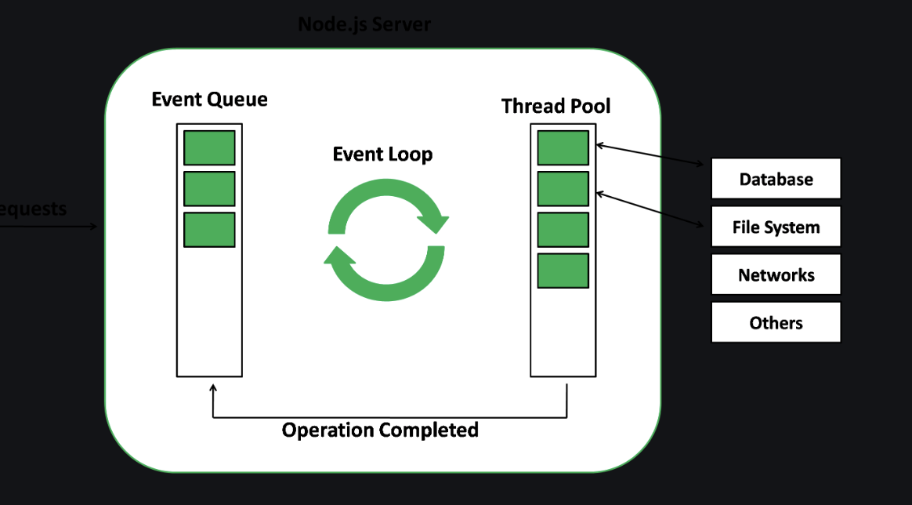

# Event loop in Node.js

Node.js is a platform designed for `efficient memory use`, thanks to its ability to handle
`non-blocking`, `asynchronous operations` even though it runs on a `single thread`. This is made
possible by its event-driven architecture and the use of an event loop.

In the heart of Node.js lies the `event loop`, a `never-ending cycle` that waits for tasks,
executes them, and sleeps until more tasks arrive. The event loop only starts working
on tasks from the event queue when the call stack (the place where all the tasks are
stacked up for execution) is empty. This means it doesn't interrupt any ongoing tasks.

Another important feature of the event loop is that it allows us to work with callbacks
and promises, which are fundamental in handling asynchronous operations in JavaScript.
Also, the event loop processes tasks in the order they were received, starting with the oldest.

What makes this possible is that most operating systems are multi-threaded, meaning they
can perform several operations simultaneously. When Node.js encounters an operation,
it hands it off to the operating system. Once the operation is complete, the operating
system informs Node.js, which then places the corresponding callback into the event queue
to be eventually executed by the event loop.

This architecture lets Node.js efficiently manage tasks without blocking the flow of operations,
making it highly efficient for handling many `simultaneous operations`.

example

```js
console.log('This is the first statement'); // 1

setTimeout(function () {
  console.log('This is the second statement'); // 3
}, 1000);

console.log('This is the third statement'); // 2
```

Let's go through an example with three tasks: two console log statements and a setTimeout
function. Here's what happens:

The first console log is sent to the `call stack`, where it gets `executed`.
"This is the first statement" is displayed in the console. Once done, it's removed from `the stack`.

Next, the setTimeout function is sent to the `operating system` with a timer.
It's removed from the `stack` while we wait for the timer to complete.

The third console log goes into the `call stack`, gets `executed`, and
"This is the third statement" is displayed. This task is then removed from `the stack`.

Once the `setTimeout timer finishes` (after 1000ms in our example), its
`callback function` is sent to the `event queue`. The `event loop`, seeing that the
`call stack is now empty`, moves this callback function to the `call stack`.

Finally, the callback function for setTimeout gets executed and
"This is the second statement" is displayed.

It's important to note that even if we set the timer to 0ms in setTimeout,
it will still be executed after the console logs. This is because the callback function
will be sent to the `event queue` and only moved to the `call stack` once it's empty,
which is after all initial tasks (like our console logs) have finished running.

## Working of the Event loop

The event loop is at the core of Node.js. When Node.js starts, it `fires up the event loop`, executes the given script, sets up any async API calls or timers, and then begins processing the event loop. For example, if you start with a script that has a couple of console.log() commands and a setTimeout(), these get lined up for processing by the event loop.

Node.js employs a special library module named 'libuv' for performing async operations. This library, along with Node.js's own logic, manages `a thread pool` known as the 'libuv thread pool'. This pool, which has four threads, is used for handling tasks that are too heavy for the event loop. Examples of such tasks include I/O operations, opening and closing connections, and managing setTimeouts.

Once a task in the thread pool is done, it triggers a callback function. This function can manage any errors or carry out further tasks. This callback is then placed into the `event queue`. When the `call stack (the place where all the tasks are stacked up for execution) is empty`, the event loop picks up the callback from the event queue and sends it to the call stack for execution.



## Phases of the Event loop

The event loop in consists of several phases, each of which performs a specific task

### 1. Timers

The timers phase of Node.js deals with functions like `setTimeout()` and `setInterval()`.

Consider this example:

```js
console.log('Start'); // 1

setTimeout(() => {
  console.log('Timeout callback'); // 3
}, 2 * 1000);

console.log('End'); // 2
```

Here, we're using setTimeout() to schedule a function that will print "Timeout callback" after 2 seconds (2000 milliseconds). This function is `added to the event queue during the timers phase`, and the event loop will get to it `once it has finished all the immediate, synchronous tasks`.

This is what you'll see printed:

```Markdown
Start
End
Timeout callback
```

Despite "Timeout callback" being scheduled before "End" is printed, it only shows up after "End". That's because setTimeout() is a non-blocking function. Its callback doesn't disrupt the flow of synchronous code, and instead waits its turn in the event loop.

### 2. Pending Callbacks

This phase handles `callbacks` that are put in the `queue` by functions that work in the background.

Here's an example to show how it works:

```js
console.log('Start'); // 1

setImmediate(() => {
  console.log('Immediate callback'); // 3
});

console.log('End'); // 2
```

In this example, the setImmediate() function schedules a callback to print "Immediate callback" later on. It's added to the queue, and the system will process it after certain other tasks. So the output will be:

```Markdown
Start
End
Immediate callback

```

### 3. Idle, Prepare:

The "idle.ignore" phase isn't part of the standard event loop in Node.js; it's something used only within the system. Normally, the "idle" phase is when the event loop has no tasks and can perform background actions like garbage collection.

However, "idle.ignore" is a way to skip this idle time. It means that the system won't use this time for background tasks.

Here's an example of how to use "idle.ignore" with the 'idle-gc' package:

```js
const { idle } = require('idle-gc');

idle.ignore();
```

Using "idle.ignore" can make sure the event loop is always busy, not performing background tasks. It might be helpful in special cases, but generally, it's not recommended. Using "idle.ignore" could lead to performance problems, so it should only be used when specifically needed.

### 4. Poll:

This phase looks for new input/output (I/O) events and handles any that are found.

Here's an example using a readStream to explain how the poll phase works:

```js
const fs = require('fs');
const readStream = fs.createReadStream('./file.txt');

console.log('Start');

readStream.on('data', (chunk) => {
  console.log(chunk.toString());
});

console.log('End');
```

In this code, we're setting up a readStream to read a file. When the 'data' event happens, it's put into the queue during the `poll phase`, and the event loop handles it after other pending tasks. The result is that the file's content is printed out.

### 5.Check

In this phase, any `callbacks scheduled with the setImmediate()` function are handled.

Here's an example showing how it works:

```js
console.log('Start');

setImmediate(() => {
  console.log('Immediate callback');
});

console.log('End');
```

In this code, we use the setImmediate() function to schedule a callback that will print "Immediate callback." It's added to the queue during the `check phase`, and the system will process it after the poll phase. So the output will look like this:

```Markdown
Start
End
Immediate callback

```

### 6.Close Callbacks

This phase deals with callbacks related to the closing of a socket. Any code that must run when a socket is closed will be placed in the message queue and handled during this phase.

Here's an example of how it works:

```js
const net = require('net');
const server = net.createServer((socket) => {
  socket.on('close', () => {
    console.log('Socket closed');
  });
});

server.listen(8000);
```

In this code, a server is set up using the net module, and the 'close' event is added to the queue in this phase. When a client closes the connection, the system will print "Socket closed" and handle it during the `close callbacks` phase.

Keep in mind that the `order of these phases might vary`, but `generally, they're processed in the order mentioned above`. The event loop keeps cycling through these phases until there are no more messages in the queue.

### Conclusion

The event loop is at the heart of Node.js, empowering it to manage numerous simultaneous connections and conduct non-blocking I/O tasks. Grasping the intricacies of the event loop is vital for crafting robust and speedy server-side applications in Node.js. By fully comprehending how the event loop functions, developers can harness the full potential of Node.js, leading to the creation of applications that are not only high-performance but also scalable and efficient. This understanding opens the door to optimized coding practices that align with the unique architecture of Node.js, making it an indispensable tool for modern development.

## Sources

- [Node.js event loop](https://www.geeksforgeeks.org/node-js-event-loop/)
